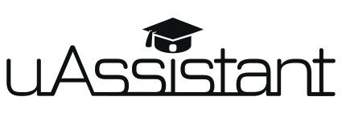

# 
 **uAssistant** - *your personal mobile-app education assisstant.*

#### Developed by students, and for students.

## Getting Started

The ultimate goal of our project - is to develop an Android application that would act as a mobile assistant in educational proccess for university students and teachers.
#### Readme status: *in Dev* (will be modified in future)

### Prerequisites

What things you need to install the software and how to install them

```
Give examples
```

### Installing

A step by step series of examples that tell you how to get a development env running

Say what the step will be

```
Give the example
```

And repeat

```
until finished
```

End with an example of getting some data out of the system or using it for a little demo

## Running the tests

Explain how to run the automated tests for this system

### Break down into end to end tests

Explain what these tests test and why

```
Give an example
```

### And coding style tests

Explain what these tests test and why

```
Give an example
```

## Deployment

Add additional notes about how to deploy this on a live system

## Built With

* [Gradle](https://gradle.org/) - Android project builder(assembler).
Google chose Gradle as the official build tool for Android; not because build scripts are code, but because Gradle is modeled in a way that is extensible in the most fundamental ways. Gradle's model also allows it to be used for native development with C/C++ and can be expanded to cover any ecosystem. For example, Gradle is designed with embedding in mind using its Tooling API.

## Contributing

Please read [CONTRIBUTING.md] (*inDev*)


## Authors

* **Alex Panishchev** - *Team Leader* - [giik0n](https://github.com/giik0n)

* **Sabee Vargha** - [VarghaSabee](https://github.com/VarghaSabee)

* **Norbert Pastor** - [digiwua](https://github.com/digiwua)

* **Andrew Saienko** - [Deimos308](https://github.com/Deimos308)

See also the list of [contributors](https://github.com/your/project/contributors) who participated in this project.

## License

This project is licensed under the MIT License - see the [LICENSE.md](LICENSE.md) file for details

## Acknowledgments

* Hat tip to anyone whose code was used
* Inspiration
* etc
